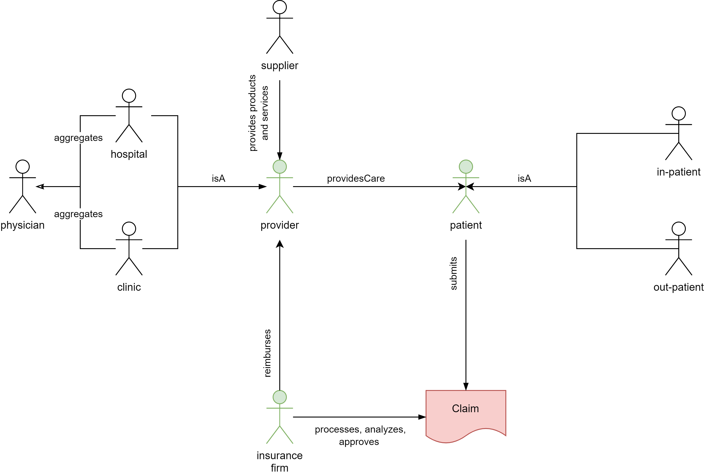
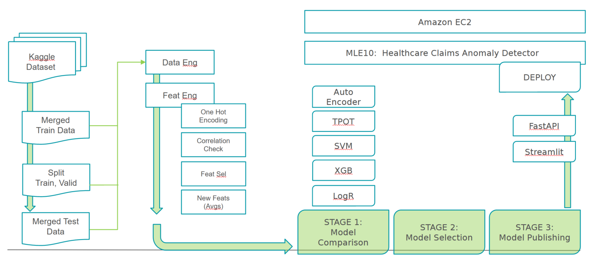
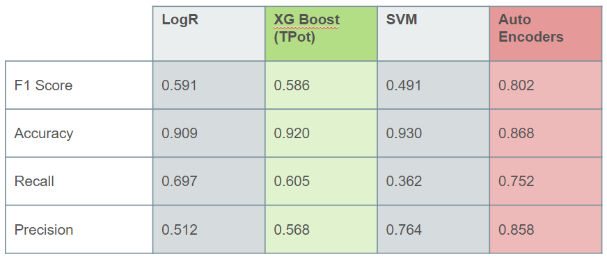
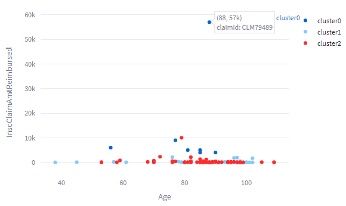
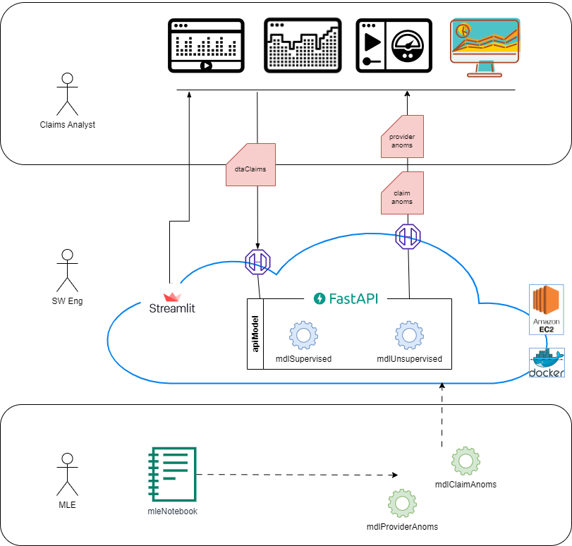

# MLE10-Capstone-Project

## Health Care Claims - Anomaly Detection  
&nbsp;  
### **About:  Problem Domain** 
Healthcare fraud is a serious white-collar crime in the US.  The National Health Care Anti-Fraud Association conservatively estimates that 3 percent of US healthcare spending is lost to fraud ($70B/yr); upwards of $300B/yr. 

This is an increasingly sophisticated crime due to collusion between multiple players including suppliers, laboratories, physicians and others.  

This capstone explores Machine Learning techniques to detect anomalies in provider and claims data.  As fraud becomes more sophisticated across an increasing number of annual transactions, an ML solution provides an opportunity to greatly reduce the effort, time and associated cost spent in identifying claims anomalies, and recouping any misappropriated funds.

&nbsp;  

### **Implications**
Healthcare fraud impacts the overall system in a number of ways.  For example, it can easily overwhelm the system with unnecessary procedure requests, thereby denying timely access to those truly in need.  Generally, the cost of fraud also translates to increased costs for everyone, and ultimately through increased insurance premiums.  In addition, with increased costs of care, the average accessibility and value of care is reduced for all.

Abuse across the healthcare system can take many forms such as:
    - Billing for services that were not rendered.
    - Duplicate submission of a claim for the same service.
    - Charging for a more complex or expensive procedure than what was actually provided.
 
 In addition, there can be unintentional mistakes that result in erroneous charges.

&nbsp;

### **Business Objectives**
Fraud detection as a growing issue, cannot be combatted effectively simply through an increase in manpower, ie trained hands and eyes.  This approach alone is fraught with human error, and bias  Faced with evolving criminal sophistication, a data driven technological solution is required.

This Capstone explores whether Machine Learning Techniques can be effective to:
- Automate the overall process for detection, model monitoring, and optimization
- Reduce the overall time and cost for claims anomaly detection, and fraud avoidance and/or reclamation
- Improve accuracy and minimize invalid, and/or erroneous claims and reimbursements
- Introduce a measure of consistency and methodology for continuous improvement
- Continually evolve in response to shifting data and criminal behaviour patterns

Additionally, for future consideration, can Data Science:
- Recommend course guidelines for claim anomaly (pre) filters and rule sets
- Provide supplementary insights, details, and key contributing factors of each anomaly
- Weigh the % likelihood and impact of anomaly to assist with case prioritization?
- Provide a framework for community vigilence, and self-serve tools for each actor (ie patient, physician, insurance, provider, supplier) to early detect anomalies at any phase in the value chain 

&nbsp;

### **Approach**
To illustrate the capabilities of Machine Learning to identify claims anomalies, this capstone project team has developed two solutions:  
    • a supervised Logistic Regression Model to identify potential anomalies at the provider level
    • an unsupervised KMeans Clustering Model to identify potential anomalies at the claim level
 
&nbsp;

### **Data**
The dataset for the capstone project was obtained from Kaggle:
https://www.kaggle.com/code/rohitrox/medical-provider-fraud-detection/data

The Kaggle data was highly anonymized/masked, and divided into four key sections:
- Masked Provider data: labeled as fraud or not (506 Yes,  4904 No)
- Masked Beneficiary data
- In-patient data
- Out-patient data

Additionally, pre-split Train and Test files were provided  (558k vs 135k, respectively)

Other supplementary information included:  Geography, Age, Race, Procedure codes etc.

Generally, the data can be modelled with three core actors, who can each benefit from this solution.

&nbsp;

### **Modeling**

&nbsp;

#### **Approach 1:  Supervised Modelling - Provider Labels**

A Model Comparison was performed between four different approaches:
- Logistic Regression
- Support Vector Machines
- XGBoost Classifier
- TPOT Auto-ML
- Auto-Encoders

In summary, Auto-ML (TPot) recommended XGBoost as the preferred model.  This model was selected for deploy based on relative overall performance.

Auto-Encoder results were very promising, however it was not selected due to the nature of the labelled data, ie True labels being an incomplete measure of what is known, and False representing indeterminate versus Non-Fraud.

The selected XGBoost model was able to predict and label likely Providers with associated anomalies/fraud.

&nbsp;

#### **Approach 2:  Unsupervised Modelling - Claims** 

Predicting Anomalies at a Claims level was performing using KMeans clustering.

Three significant clusters were identified and test claims were appropriately labelled to the appropriate cluster.

&nbsp;

### **MLE Stack**

&nbsp;

### **Development and Deployment**
These solutions are hosted on Amazon EC2 utilizing a Streamlit front end for illustration.  Fast API endpoints are in final development to expose the model for on-demand supervised and unsupervised predictions. 

Please refer to the [Technical README](./demo/README-Technical.md) for further details on the technical environment, components, toolsets, and development and deployment instructions.

&nbsp;

### **Future Considerations**
The solution shows promise for Provider and Claim predictions.

There are a few areas for potential solution improvement under future consideration:
- Business Value:  The solution can benefit from a human feedback loop to reinforce which predictions were accurately deemed fraudulent.  A % weighting of anomaly risk, and provision for supplemental details to support the basis for anomaly detection would lend assistance to the claims analyst and/or patient.    
- Data:  Acquiring labelled claims data would improve the supervised learning approach, with clear indications of confirmed fraud, as well as confirmed non-fraud. 
- Model Performance:  Variational Auto-encoders have shown promise in other industries (credit card fraud),  given sufficient data and confirmed positive and negative fraud indicators, an investigation into similar application for the Healthcare Industry would be of interest.    
- Streamlit:  the UI/UX interface can be expanded to support further self-serve claim anomaly detection for patients, insurance firms, and providers. 
- FastAPI:  the api can be expanded to include convenience functions for data verification, and model prediction requests 
- ML Ops:  Currently Model monitoring, retraining, and optimization is highly manual.  Additional effort and investment needs to be made to introduce automation.  

&nbsp;

### **Conclusions**
Machine Learning techniques can be applied to lend aspects of automation, accuracy, and insight into anomaly detection associated to both Providers and Claims.  The technology shows promise as a self-serve utility for each key actor in the value chain.  Fraud is an ever evolving crime,  so a data driven solution will naturally adapt to changes in attack vector.  As outlined in the Future Considerations section, further work is required to improve data representation, human feedback strategies, and alternative model performance.  

